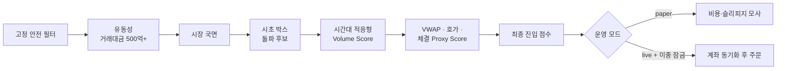
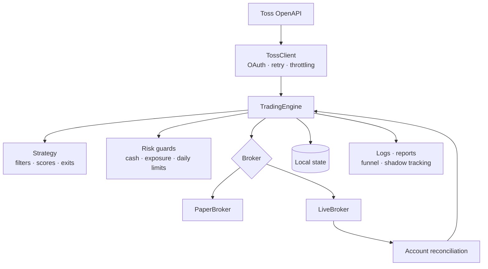

# Toss Auto Trading

> Toss Securities OpenAPI 기반의 국내 주식 단기 모멘텀 자동매매 시스템
> A safety-first, evidence-driven momentum trading system for the Korean stock market.


단순히 매수·매도 신호를 만드는 데 그치지 않고, **잘못된 주문을 내지 않는 구조**와
**실험 결과를 재현할 수 있는 관측 체계**에 초점을 둔 개인 프로젝트입니다. 후보 탐색,
다단계 필터링, paper/live broker 분리, 주문 복구, 일일 리스크 제한, 운영 보고서까지
자동매매의 전체 실행 흐름을 Python 표준 라이브러리만으로 구현했습니다.

현재 기본 운영 모드는 `paper`입니다. 실거래 경로는 계좌 상태 동기화와 이중 잠금을
통과해야 하며, paper에서 검증 중인 전략은 live에 자동 반영되지 않습니다.

## 프로젝트 한눈에 보기

| 구분 | 내용 |
| --- | --- |
| 대상 | 국내 주식 단기 모멘텀·돌파 후보 |
| 데이터/주문 | Toss Securities OpenAPI REST polling |
| 핵심 흐름 | 종목 랭킹 → 안전·유동성 필터 → 시장 국면 → 돌파 → 적응형 점수 → 주문 |
| 리스크 관리 | 주문 금액·보유 수·일일 진입·일일 손실 제한, stale data 차단, 강제 청산 |
| 안정성 | single-instance lock, pending journal, 부분 체결·취소·재시작 복구, 계좌 reconciliation |
| 검증 | 네트워크 없는 `unittest`, paper 체결, filter funnel·shadow 사후 추적 |
| 운영 환경 | Windows, Python 3.11+, PowerShell, Windows Task Scheduler |

## 전략 파이프라인



기본 진입 시간은 오전 `10:00~11:30`, 오후 `14:50~15:30`이며 `15:35`에
강제 청산합니다. 오전에는 09:00~09:30의 고가·저가로 만든 시초 박스를 기준으로
돌파와 거래량을 확인합니다. 기관 순매수 원천 데이터가 제공되지 않는 제약은 VWAP,
호가 불균형, 체결 강도성 지표를 조합한 proxy score로 보완합니다.

고정 안전장치를 통과한 뒤에도 다음 조건을 순차 적용합니다.

- 레버리지·인버스 상품 제외, 시세 신선도와 스프레드 검증
- 당일 거래대금 500억 원 이상과 가격 변동 범위 확인
- 시장 지수의 5분·15분 흐름으로 하락 국면 필터링
- 시초 박스 돌파, 적응형 거래량, VWAP, 호가, 체결 proxy 점수화
- 현금·포지션·일일 진입 횟수·일일 손익 한도와 최종 신호 재검증

## 설계에서 중요하게 다룬 문제

### 1. paper와 live의 격리

`PaperBroker`와 `LiveBroker`를 분리했습니다. paper는 불리한 슬리피지와 수수료·세금
모델을 반영하지만 외부 주문을 만들지 않습니다. 실험 중인 추세 지속 보조 진입과
5분·10분 포지션 재평가는 paper에서만 실행됩니다.

### 2. 계좌 상태를 진실의 원천으로 사용

live 시작 시 보유 종목, 미체결 주문, 주문 가능 금액을 조회해 로컬 상태와 대조합니다.
동기화가 `SUCCEEDED`가 아니면 신규 진입을 차단하되, 기존 포지션의 위험 청산 경로는
유지합니다.

### 3. 주문 장애와 재시작 복구

주문 제출 전에 pending journal을 기록하고, 서버 주문 ID·부분 체결·timeout 취소를
추적합니다. 프로세스가 재시작되면 미완료 주문을 복구 대상으로 읽어 중복 주문 위험을
줄입니다.

### 4. 결과보다 근거를 남기는 실험

각 후보가 어느 필터에서 탈락했는지 `filter_funnel`에 기록하고, 진입하지 않은 후보도
5/10/15/30분 수익률과 MFE/MAE를 `shadow_tracking`으로 추적합니다. 전략 변경은
단일 사례가 아니라 서로 다른 episode의 사후성과를 비교한 뒤 paper에 한정해 적용합니다.

## 시스템 구조



## 디렉터리 구조

```text
auto-trading/
├─ src/toss_trader/
│  ├─ api.py              # OAuth, 시세·계좌·주문 REST client
│  ├─ broker.py           # paper 체결과 live 주문 수명주기
│  ├─ config.py           # 환경 설정, 검증, live 이중 잠금
│  ├─ engine.py           # 스캔, 리스크, 주문, 포지션, 복구 orchestration
│  ├─ reconciliation.py   # live 계좌와 로컬 상태 동기화
│  ├─ reporting.py        # 날짜별 운영 보고서
│  ├─ state.py            # 포트폴리오·주문 상태 저장
│  ├─ strategy.py         # 진입 점수, 수량, 청산·포지션 재평가
│  └─ cli.py              # CLI와 single-instance runner
├─ tests/                 # 네트워크를 사용하지 않는 unittest
├─ scripts/               # 설치, 실행, 예약 작업, watchdog, 비상 정지
├─ docs/                  # 아키텍처, 설계 결정, 실험·운영 검토
├─ report/                # Git에 보존하는 소형 날짜별 운영 보고서
├─ reports/               # 로컬 상세 진단 데이터 (Git 제외)
├─ logs/                  # 로컬 runner·trading 로그 (Git 제외)
├─ state/                 # 로컬 계좌·주문 상태 (Git 제외)
├─ .env.example           # 비밀값 없는 설정 예시
└─ pyproject.toml
```

로컬 `.env`, `.venv/`, `logs/`, `state/`, `reports/`는 Git에서 제외됩니다.

## 빠른 시작

### 요구 환경

- Windows PowerShell
- Python 3.11 이상
- Toss Securities OpenAPI 사용 권한

런타임 외부 패키지는 없습니다.

```powershell
.\scripts\setup.cmd
Copy-Item .env.example .env
```

`.env`에 발급받은 값을 로컬에서만 입력합니다.

```dotenv
TOSS_CLIENT_ID=
TOSS_CLIENT_SECRET=
TOSS_ACCOUNT_SEQ=
TRADING_MODE=paper
LIVE_TRADING_CONFIRM=
```

실행 명령은 다음과 같습니다.

```powershell
.\scripts\run.cmd status  # 로컬 상태 확인
.\scripts\run.cmd check   # API·설정 점검
.\scripts\run.cmd scan    # 후보 스캔
.\scripts\run.cmd once    # 1회 전략 사이클
.\scripts\run.cmd run     # 장중 반복 runner
.\scripts\run.cmd report  # 일일 보고서 생성
.\scripts\stop.cmd        # 예약 작업·runner 비상 정지
```

`check`, `scan`, `report`도 Toss API를 호출할 수 있습니다. `once`, `run`은 live
설정에서 실제 주문을 만들 수 있으므로 연결 테스트 용도로 실행하면 안 됩니다.

## 안전한 live 활성화

다음 두 설정이 동시에 정확해야 live 주문 경로가 열립니다.

```dotenv
TRADING_MODE=live
LIVE_TRADING_CONFIRM=I_UNDERSTAND_REAL_MONEY
```

설정만으로 충분하지 않습니다. WTS 허용 IP, 국내주식 사전 동의, 주문 가능 상태와
live startup reconciliation도 모두 정상이어야 신규 진입이 허용됩니다. 전략과 무관한
테스트 주문은 코드와 운영 원칙상 허용하지 않습니다.

## 테스트

```powershell
$env:PYTHONPATH = "$PWD\src"
.\.venv\Scripts\python.exe -m compileall -q src tests
.\.venv\Scripts\python.exe -m unittest discover -s tests -v
git diff --check
```

단위 테스트는 fake client를 사용하며 실제 Toss API와 실제 주문을 호출하지 않습니다.

## 검토 자료

- [포트폴리오 소개와 설계 과정](docs/PORTFOLIO_OVERVIEW.md)
- [현재 아키텍처](docs/ARCHITECTURE.md)
- [구현 및 안전 상태](docs/PROJECT_STATE.md)
- [전략·운영 설계 결정](docs/DECISIONS.md)
- [기관 수급 proxy 설계](docs/INSTITUTIONAL_PROXY.md)
- [주간 진입 전략 검토](docs/WEEKLY_ENTRY_REVIEW_2026-08-22.md)
- [paper 포지션 관리 실험](docs/PAPER_POSITION_MANAGEMENT_2026-08-24.md)
- [날짜별 운영 리포트](report/README.md)

대표 주간 검토에서는 6개의 서로 다른 shadow episode와 2건의 paper 왕복 거래를
분석해, 엄격한 돌파 필터를 전면 완화하지 않고 고품질 추세 지속 경로만 paper에
추가했습니다. 이 결과는 전략 검증 방식의 예시이며 수익성을 입증하는 표본은 아닙니다.

## 현재 한계와 다음 과제

- paper 체결은 호가 잔량 충격, 네트워크 지연, 부분 체결을 완전히 재현하지 않습니다.
- 실제 API schema, 수수료·세금, 장 마감 강제청산은 승인된 live 환경에서 재검증이 필요합니다.
- 주문 정정, 연속 거래손실 guard, 독립적인 전체 노출 한도, 원격 알림은 미구현입니다.
- paper 실험을 live로 승격하기에는 서로 다른 시장 국면의 관측 표본이 더 필요합니다.

## 보안과 면책

인증정보·계좌 식별값은 `.env` 또는 OS 자격증명 저장소에서만 관리하며 저장소와
운영 보고서에 기록하지 않습니다. 이 프로젝트는 학습·포트폴리오·개인 검증 목적이며,
투자 권유가 아닙니다. 수익을 보장하지 않고 실제 거래에는 원금 손실 위험이 있습니다.

공식 API 문서: [Toss Securities OpenAPI 가이드](https://developers.tossinvest.com/docs)
